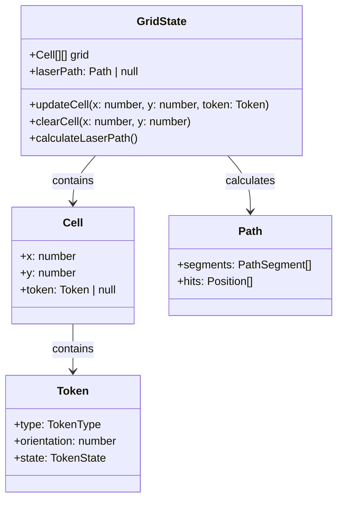
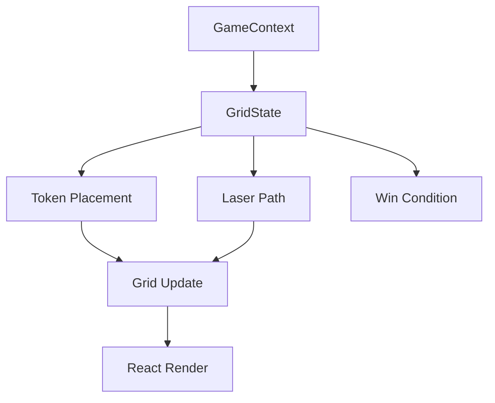

# Grid System Architecture

## Overview
A simple yet extensible architecture for the Laser Maze game's 5x5 grid system, designed for performance and maintainability.

## Data Structure Design



### Core Types

```typescript
type Cell = {
  token: Token | null;
};

type Token = {
  type: 'laser' | 'mirror' | 'target';
  orientation: 0 | 90 | 180 | 270;
  state: TokenState;
};

type Grid = Cell[][];
```

### Key Features
- Simple 2D array implementation (`grid[y][x]`)
- One token per cell limitation
- No default blocked cells
- Immutable state updates for React optimization

## State Management



### Core Operations Interface

```typescript
interface GridOperations {
  placeToken(x: number, y: number, token: Token): void;
  removeToken(x: number, y: number): void;
  rotateToken(x: number, y: number, angle: number): void;
  calculateLaserPath(): Path;
}
```

## Performance Optimizations

1. Laser Path Calculations
   - Memoize path calculations using React.memo
   - Cache invalidation on grid state changes
   - Recalculate only on:
     - Token placement
     - Token rotation
     - Explicit laser firing

2. State Updates
   - Immutable state patterns
   - Batch updates where possible
   - Use TypeScript for type safety
   - Implement undo/redo capability

## Implementation Guidelines

1. Grid State Management
   - Store in GameContext
   - Use reducer pattern for complex updates
   - Maintain immutability

2. Token Operations
   - Validate placement before updates
   - Handle rotation with simple angle math
   - Clear laser path on any grid change

3. Performance Considerations
   - Memoize expensive calculations
   - Batch state updates
   - Use React's useMemo and useCallback hooks

## Architecture Benefits

1. Simplicity
   - Straightforward data structure
   - Clear update patterns
   - Easy to reason about state

2. Extensibility
   - Easy to add new token types
   - Simple to modify grid dimensions
   - Clear patterns for feature additions

3. Performance
   - Optimized for React rendering
   - Efficient laser path calculations
   - Minimal memory footprint

## Confidence Score: 9/10
Rationale: The architecture follows KISS and DRY principles while providing all required functionality and clear paths for future enhancements.