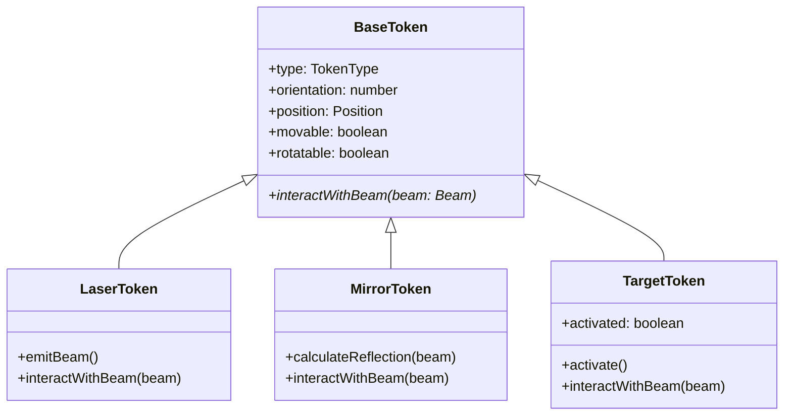

# Token System Design

## Overview
A minimalist token system for the Laser Maze game, emphasizing KISS and DRY principles.

## Core Design Principles
- Minimal state management
- Composition over inheritance
- Token-handled beam interactions
- Simple, focused interfaces

## Base Structure

```typescript
interface Position {
  row: number;
  col: number;
}

interface BaseToken {
  type: TokenType;
  orientation: number;
  position: Position;
  movable: boolean;
  rotatable: boolean;
  interactWithBeam(beam: Beam): BeamInteraction;
}

type BeamInteraction = {
  action: 'CONTINUE' | 'REFLECT' | 'ACTIVATE' | 'BLOCK';
  newBeams: Beam[];
}

type Beam = {
  direction: number;
  position: Position;
}
```

## Token Types



## Implementation Details

### 1. Laser Token
```typescript
class LaserToken implements BaseToken {
  type = 'laser';
  orientation: number;
  position: Position;
  movable = false;
  rotatable = false;

  emitBeam(): Beam {
    return {
      direction: this.orientation,
      position: this.position
    };
  }

  interactWithBeam(beam: Beam): BeamInteraction {
    return { action: 'BLOCK', newBeams: [] };
  }
}
```

### 2. Mirror Token
```typescript
class MirrorToken implements BaseToken {
  type = 'mirror';
  orientation: number;
  position: Position;
  movable: boolean;
  rotatable: boolean;

  calculateReflection(beam: Beam): Beam {
    const reflectedDirection = (beam.direction + 2 * this.orientation) % 360;
    return {
      direction: reflectedDirection,
      position: this.position
    };
  }

  interactWithBeam(beam: Beam): BeamInteraction {
    return {
      action: 'REFLECT',
      newBeams: [this.calculateReflection(beam)]
    };
  }
}
```

### 3. Target Token
```typescript
class TargetToken implements BaseToken {
  type = 'target';
  orientation: number;
  position: Position;
  movable: boolean;
  rotatable: boolean;
  activated = false;

  activate(): void {
    this.activated = true;
  }

  interactWithBeam(beam: Beam): BeamInteraction {
    this.activate();
    return { action: 'ACTIVATE', newBeams: [] };
  }
}
```

## Token Factory
```typescript
const createToken = (type: TokenType, config: TokenConfig): BaseToken => {
  switch (type) {
    case 'laser':
      return new LaserToken(config);
    case 'mirror':
      return new MirrorToken(config);
    case 'target':
      return new TargetToken(config);
    default:
      throw new Error(`Unknown token type: ${type}`);
  }
};
```

## Design Benefits
1. **Simplicity**
   - Clear, focused token responsibilities
   - Minimal state management
   - Straightforward interaction patterns

2. **Maintainability**
   - Easy to add new token types
   - Simple testing of individual components
   - Clear separation of concerns

3. **Extensibility**
   - Token behavior can be enhanced through composition
   - New beam interactions can be added easily
   - Future token types can reuse existing patterns

## Trade-offs

1. **Token-Handled Interactions**
   - **Pro**: Simple, encapsulated behavior
   - **Con**: May need refactoring for complex physics

2. **Minimal State**
   - **Pro**: Reduces complexity and bugs
   - **Con**: Might need expansion for advanced features

## Next Steps
1. Implement the base token system
2. Add unit tests for each token type
3. Integrate with the grid system
4. Add visual representations
5. Implement the token factory