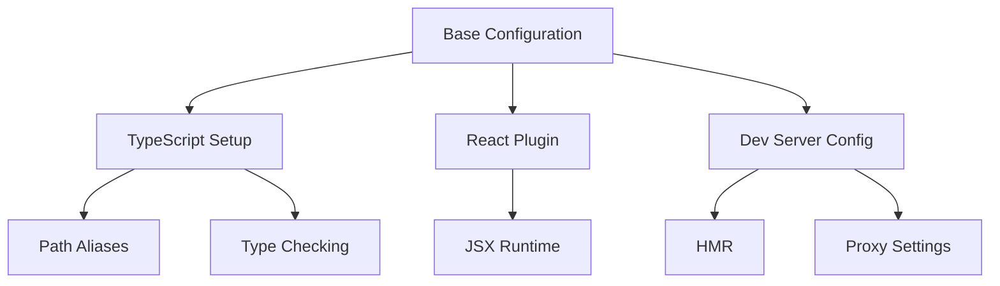
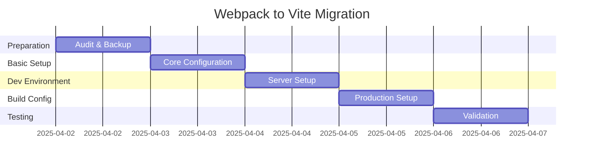

# Webpack to Vite Migration Analysis

## Technical Rationale

### Why Vite?

1. **Modern Development Experience**
   - Native ESM-based dev server
   - Instant server start
   - True on-demand compilation
   - Out-of-the-box TypeScript and JSX support

2. **Build Performance**
   - Rollup-based production builds
   - Better code splitting
   - Optimized asset handling
   - Efficient caching strategies

3. **Developer Experience**
   - Simpler configuration
   - Better error messages
   - Built-in features that previously required extra webpack plugins
   - Native TypeScript support without requiring babel-loader

4. **Future-Proof Architecture**
   - Based on native ES modules
   - Better alignment with modern web standards
   - Active development and community support

## Configuration Requirements

### Core Configuration Needs



### Required Configurations:

1. **Base Vite Config**
   ```typescript
   - Root directory
   - Build output settings
   - Environment variables
   - Asset handling
   ```

2. **TypeScript Integration**
   ```typescript
   - TSConfig path
   - Type checking in build
   - Path aliases migration
   ```

3. **React Setup**
   ```typescript
   - @vitejs/plugin-react configuration
   - JSX runtime settings
   - Fast refresh options
   ```

4. **Development Server**
   ```typescript
   - Port configuration
   - HTTPS settings
   - Proxy configuration
   ```

## Migration Concerns

### Potential Challenges

1. **Build Output Differences**
   - Asset handling changes
   - Code splitting strategies
   - Public path handling

2. **Dependencies**
   - CommonJS dependencies that need ESM versions
   - React-scripts removal
   - Development tooling updates

3. **Testing Setup**
   - Vitest is already configured (low risk)
   - Test environment maintenance
   - Test file location patterns

4. **Environment Variables**
   - Migration from CRA-style to Vite-style
   - `.env` file handling differences
   - Import.meta.env usage

## Migration Checklist

### Phase 1: Preparation
- [ ] Backup current webpack configuration
- [ ] Document current environment variable usage
- [ ] Audit dependencies for ESM compatibility
- [ ] Create new branch for migration

### Phase 2: Basic Setup
- [ ] Remove react-scripts
- [ ] Install Vite and related dependencies
- [ ] Create basic vite.config.ts
- [ ] Update TypeScript configuration
- [ ] Configure environment variables

### Phase 3: Development Environment
- [ ] Set up dev server configuration
- [ ] Configure HMR settings
- [ ] Update proxy settings if needed
- [ ] Test development workflow

### Phase 4: Build Configuration
- [ ] Configure build output settings
- [ ] Set up asset handling
- [ ] Configure code splitting
- [ ] Test production build

### Phase 5: Testing and Validation
- [ ] Verify all tests pass
- [ ] Check build output
- [ ] Validate development workflow
- [ ] Performance testing
- [ ] Cross-browser testing

## Implementation Timeline



## Risk Assessment

| Risk | Impact | Likelihood | Mitigation |
|------|---------|------------|------------|
| Build output differences | Medium | High | Thorough testing of built assets |
| Development workflow disruption | Medium | Low | Staged migration with fallback option |
| Testing environment issues | Low | Low | Already using Vitest |
| Environment variable conflicts | Medium | Medium | Comprehensive audit and documentation |

## Rollback Plan

1. Maintain parallel configurations until verified
2. Keep webpack setup in separate branch
3. Document all changes for quick reversal
4. Create restoration points at each phase