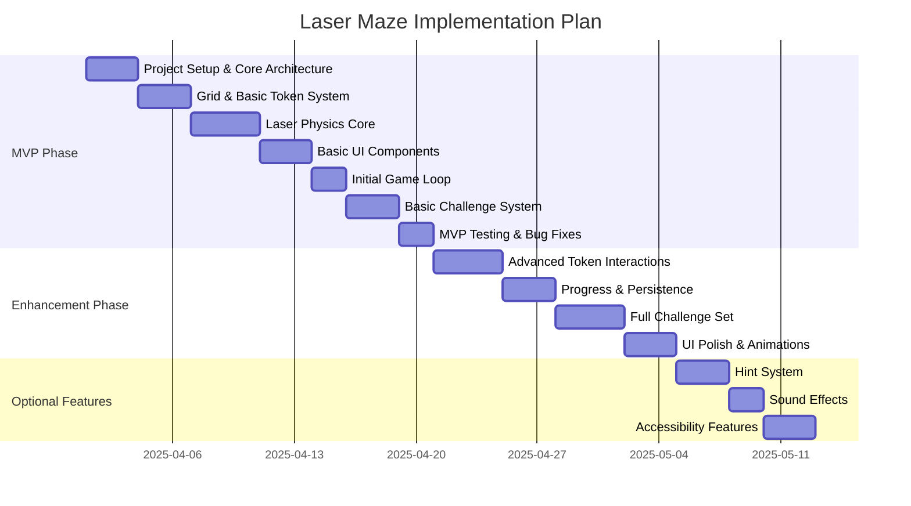

# Laser Maze Implementation Plan

## Overview

This document outlines the implementation strategy for the Laser Maze game, with a focus on delivering an MVP while maintaining a clear path to the full feature set.

## Timeline and Phases

## Implementation Strategy

### 1. Core Architecture
- Component-based React architecture
- Context API for state management
- TypeScript for type safety
- Modular design for easy expansion

### 2. Development Approach
- Start with essential features
- Regular testing points
- Progressive enhancement
- Performance optimization throughout

### 3. Technical Dependencies
- React with TypeScript
- Tailwind CSS for styling
- Vitest + React Testing Library
- Development tools (ESLint, etc.)

## Risk Management

### High Priority Risks
1. **Laser Physics Engine**
   - Complex calculations
   - Performance concerns
   - Edge cases
   
2. **State Management**
   - Complex game state
   - Real-time updates
   - Performance impact

### Mitigation Strategies
1. **Early Prototyping**
   - Build physics engine first
   - Thorough testing
   - Performance profiling

2. **Modular Architecture**
   - Clear separation of concerns
   - Encapsulated components
   - Easy to test and debug

## Testing Strategy

### Unit Testing
- Component testing
- Utility function testing
- Physics engine validation

### Integration Testing
- Game flow testing
- Challenge completion
- State management

### User Testing
- Playability testing
- Performance testing
- Cross-browser validation

## Deployment Strategy

### 1. Development
- Local development setup
- Hot reloading
- Debug tooling

### 2. Staging
- Production-like environment
- Integration testing
- Performance testing

### 3. Production
- Static site hosting
- CDN integration
- Monitoring setup

## Success Criteria

### MVP Requirements
1. Working game mechanics
2. Basic challenge system
3. Core token types
4. Basic UI/UX
5. Essential features only

### Quality Metrics
1. Performance benchmarks
2. Test coverage
3. Code quality standards
4. Browser compatibility